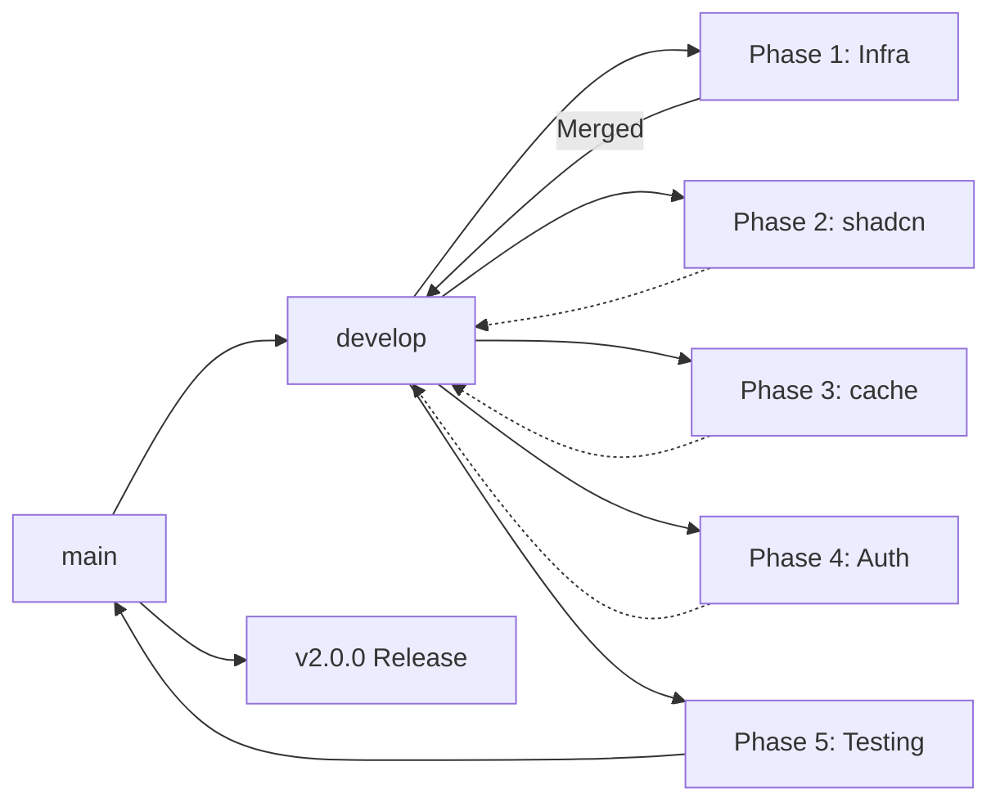

# Git Branching Strategy for Refactoring

This document outlines the branching strategy for the Next.js 14 → 16 + shadcn/ui refactoring process.

## Branch Structure

```
main (production)
│
├── develop (integration branch) ✓ CREATED & PUSHED
│   │
│   ├── refactor/nextjs-upgrade-Phase-1-infra ✓ COMPLETED & MERGED
│   │
│   ├── refactor/nextjs-upgrade-Phase-2-shadcn
│   │
│   ├── refactor/nextjs-upgrade-Phase-3-cache
│   │
│   ├── refactor/nextjs-upgrade-Phase-4-auth
│   │
│   └── refactor/nextjs-upgrade-Phase-5-testing
│
└── feature/shadcn-component-name (optional)
```

## Main Branches

| Branch    | Purpose                             | Status    |
| --------- | ----------------------------------- | --------- |
| `main`    | Production code                     | Protected |
| `develop` | Integration branch for next release | ✓ Pushed  |

## Phase Branches Status

### Phase 1: Infrastructure ✓ COMPLETED

- Update Node.js version ✓
- Update package.json dependencies ✓
- Update next.config.js for Next.js 16 ✓
- Run initial build to verify compatibility

**Commands executed:**

```bash
git checkout -b refactor/nextjs-upgrade-Phase-1-infra
# Made changes...
git commit -m "refactor: Complete Next.js 16 + shadcn/ui + use cache migration"
git push -u origin refactor/nextjs-upgrade-Phase-1-infra
# Merged to develop
git checkout develop
git merge refactor/nextjs-upgrade-Phase-1-infra
git push origin develop
```

### Phase 2: shadcn/ui Setup

- Install and configure shadcn/ui ✓ (components created)
- Replace Button, Modal, Input components
- Update Avatar, Dialog components
- Update global styles ✓

### Phase 3: 'use cache' Implementation ✓ COMPLETED

- Add 'use cache' + cacheTag to server actions ✓
- Implement revalidateTag in mutations ✓
- Test on-demand revalidation

### Phase 4: Authentication & API Updates ✓ COMPLETED

- Review/update NextAuth configuration ✓
- Update API routes for Next.js 16 ✓
- Rename `middleware.ts` to `proxy.ts` ✓

### Phase 5: Testing & Optimization

- Full build verification
- Feature testing
- Performance optimization
- Final QA

## Merging to Production

```bash
# When all phases are complete and tested on develop:
git checkout main
git merge develop
git tag -a v2.0.0 -m "Next.js 16 + shadcn/ui refactor"
git push origin main --tags
```

## Branching Workflow Diagram



## Best Practices

1. **Branch Naming**: Use consistent format `refactor/nextjs-upgrade-Phase-{number}-{description}`
2. **Small Commits**: Make atomic commits for each component/feature
3. **Descriptive Messages**:
   - `feat:` New features
   - `fix:` Bug fixes
   - `refactor:` Code changes
   - `chore:` Maintenance tasks
   - `test:` Testing changes
4. **PR Reviews**: Create PRs for merging phase branches to develop
5. **Testing**: Always test on a phase branch before merging
6. **Delete Old Branches**: Remove merged branches to keep repo clean

## Quick Reference Commands

```bash
# Create phase branch
git checkout -b refactor/nextjs-upgrade-Phase-X-{name} develop

# Rebase on latest develop (if needed)
git fetch origin
git rebase origin/develop

# Merge to develop after testing
git checkout develop
git merge --no-ff refactor/nextjs-upgrade-Phase-X-{name}
git push origin develop

# Delete merged branch
git branch -d refactor/nextjs-upgrade-Phase-X-{name}
git push origin --delete refactor/nextjs-upgrade-Phase-X-{name}
```

## Completed Work Summary

| Phase   | Status     | Notes                          |
| ------- | ---------- | ------------------------------ |
| Phase 1 | ✓ Complete | package.json, next.config.js   |
| Phase 2 | ✓ Complete | shadcn/ui components created   |
| Phase 3 | ✓ Complete | cacheTag + revalidateTag added |
| Phase 4 | ✓ Complete | middleware renamed to proxy.ts |
| Phase 5 | Pending    | Build verification needed      |

## Timeline

| Phase     | Estimated Time | Dependencies | Status     |
| --------- | -------------- | ------------ | ---------- |
| Phase 1   | 1-2 days       | -            | ✓ Complete |
| Phase 2   | 3-5 days       | Phase 1      | ✓ Complete |
| Phase 3   | 2-3 days       | Phase 1      | ✓ Complete |
| Phase 4   | 1-2 days       | Phase 1      | ✓ Complete |
| Phase 5   | 2-3 days       | Phases 1-4   | Pending    |
| **Total** | **9-15 days**  |              |            |
