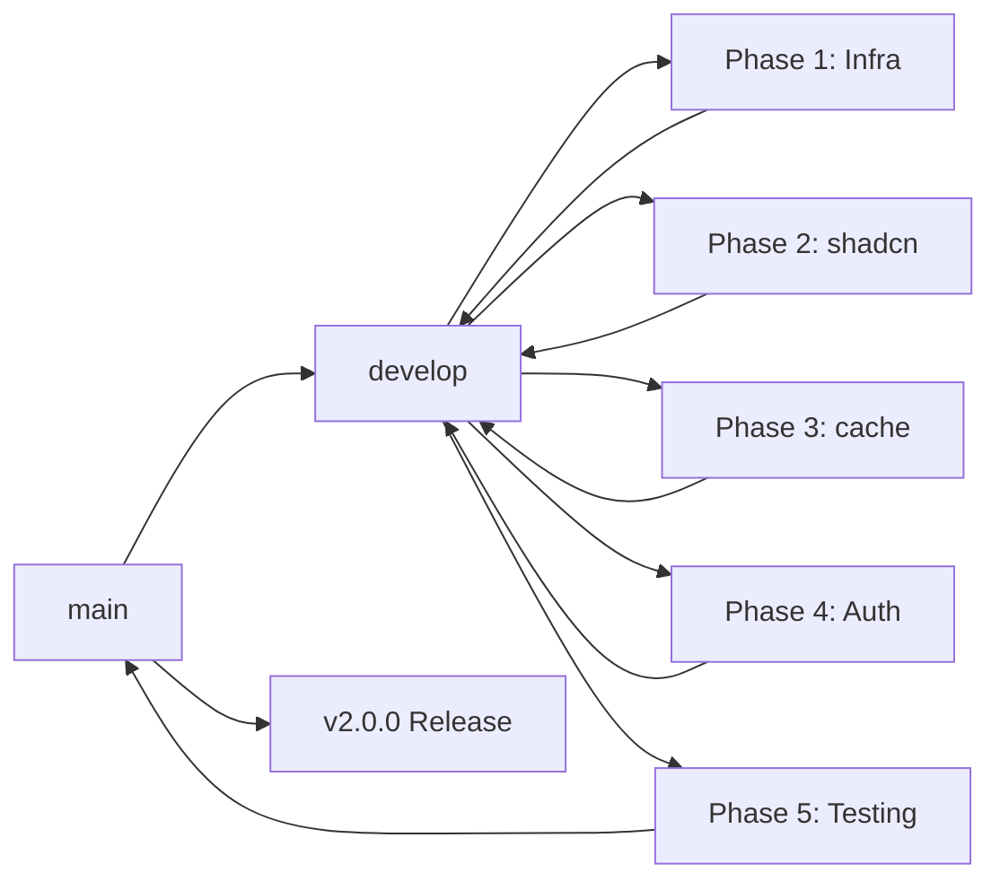

# Git Branching Strategy for Refactoring

This document outlines the branching strategy for the Next.js 14 → 16 + shadcn/ui refactoring process.

## Branch Structure

```
main (production)
│
├── develop (integration branch)
│   │
│   ├── refactor/nextjs-upgrade
│   │   │
│   │   ├── refactor/nextjs-upgrade Phase-1-infra
│   │   │
│   │   ├── refactor/nextjs-upgrade Phase-2-shadcn
│   │   │
│   │   ├── refactor/nextjs-upgrade Phase-3-cache
│   │   │
│   │   ├── refactor/nextjs-upgrade Phase-4-auth
│   │   │
│   │   └── refactor/nextjs-upgrade Phase-5-testing
│   │
│   └── feature/shadcn-component-name (optional)
```

## Main Branches

| Branch    | Purpose                             | Protected |
| --------- | ----------------------------------- | --------- |
| `main`    | Production code                     | Yes       |
| `develop` | Integration branch for next release | Yes       |

## Phase Branches

### Phase 1: Infrastructure

```
refactor/nextjs-upgrade Phase-1-infra
```

- Update Node.js version
- Update package.json dependencies
- Update next.config.js for Next.js 16
- Run initial build to verify compatibility

**Commands:**

```bash
git checkout -b refactor/nextjs-upgrade Phase-1-infra develop
# Make changes...
git commit -m "chore: Update to Next.js 16 dependencies"
git push -u origin refactor/nextjs-upgrade Phase-1-infra
# After testing, merge to develop
git checkout develop
git merge refactor/nextjs-upgrade Phase-1-infra
```

### Phase 2: shadcn/ui Setup

```
refactor/nextjs-upgrade Phase-2-shadcn
```

- Install and configure shadcn/ui
- Replace Button, Modal, Input components
- Update Avatar, Dialog components
- Update global styles

**Commands:**

```bash
git checkout -b refactor/nextjs-upgrade Phase-2-shadcn develop
# Make changes...
git commit -m "refactor: Replace custom Button with shadcn Button"
git commit -m "refactor: Replace Modal with shadcn Dialog"
git commit -m "refactor: Update globals.css for shadcn"
# After testing, merge to develop
git checkout develop
git merge refactor/nextjs-upgrade Phase-2-shadcn
```

### Phase 3: 'use cache' Implementation

```
refactor/nextjs-upgrade Phase-3-cache
```

- Add 'use cache' + cacheTag to server actions
- Implement revalidateTag in mutations
- Test on-demand revalidation

**Commands:**

```bash
git checkout -b refactor/nextjs-upgrade Phase-3-cache develop
# Make changes...
git commit -m "feat: Add cacheTag to getCurrentUser"
git commit -m "feat: Add cacheTag to getConversations"
git commit -m "feat: Add revalidateTag to message creation"
# After testing, merge to develop
git checkout develop
git merge refactor/nextjs-upgrade Phase-3-cache
```

### Phase 4: Authentication & API Updates

```
refactor/nextjs-upgrade Phase-4-auth
```

- Review/update NextAuth configuration
- Update API routes for Next.js 16
- Rename `middleware.ts` to `proxy.ts`
- Fix any compatibility issues

**Commands:**

```bash
git checkout -b refactor/nextjs-upgrade Phase-4-auth develop
# Make changes...
git commit -m "fix: Update API routes & middleware naming convention for Next.js 16"
# After testing, merge to develop
git checkout develop
git merge refactor/nextjs-upgrade Phase-4-auth
```

### Phase 5: Testing & Optimization

```
refactor/nextjs-upgrade Phase-5-testing
```

- Full build verification
- Feature testing
- Performance optimization
- Final QA

**Commands:**

```bash
git checkout -b refactor/nextjs-upgrade Phase-5-testing develop
# Make changes...
git commit -m "test: Run full test suite"
git commit -m "perf: Optimize bundle size"
# After testing, merge to develop
git checkout develop
git merge refactor/nextjs-upgrade Phase-5-testing
```

## Merging to Production

```bash
# When all phases are complete and tested on develop:
git checkout main
git merge develop
git tag -a v2.0.0 -m "Next.js 16 + shadcn/ui refactor"
git push origin main --tags
```

## Branching Workflow Diagram



## Best Practices

1. **Branch Naming**: Use consistent format `refactor/nextjs-upgrade Phase-{number}-{description}`
2. **Small Commits**: Make atomic commits for each component/feature
3. **Descriptive Messages**:
   - `feat:` New features
   - `fix:` Bug fixes
   - `refactor:` Code changes
   - `chore:` Maintenance tasks
   - `test:` Testing changes
4. **PR Reviews**: Create PRs for merging phase branches to develop
5. **Testing**: Always test on a phase branch before merging
6. **Delete Old Branches**: Remove merged branches to keep repo clean

## Quick Reference Commands

```bash
# Create phase branch
git checkout -b refactor/nextjs-upgrade Phase-X-{name} develop

# Rebase on latest develop (if needed)
git fetch origin
git rebase origin/develop

# Merge to develop after testing
git checkout develop
git merge --no-ff refactor/nextjs-upgrade Phase-X-{name}
git push origin develop

# Delete merged branch
git branch -d refactor/nextjs-upgrade Phase-X-{name}
git push origin --delete refactor/nextjs-upgrade Phase-X-{name}
```

## Timeline Estimate

| Phase     | Estimated Time | Dependencies |
| --------- | -------------- | ------------ |
| Phase 1   | 1-2 days       | -            |
| Phase 2   | 3-5 days       | Phase 1      |
| Phase 3   | 2-3 days       | Phase 1      |
| Phase 4   | 1-2 days       | Phase 1      |
| Phase 5   | 2-3 days       | Phases 1-4   |
| **Total** | \*\*9-15 days  |              |
