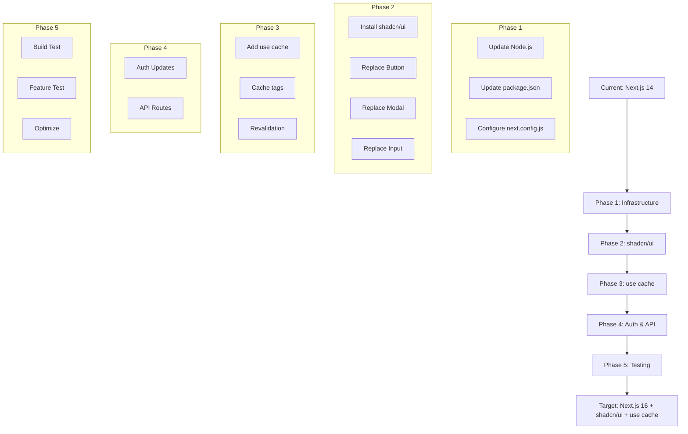

# Messenger Clone Migration Plan

## Overview

This document outlines the comprehensive migration plan for upgrading the Messenger Clone application from Next.js 14 to Next.js 16 with the new 'use cache' feature, and replacing custom UI components with shadcn/ui components.

## Current State Analysis

### Technology Stack

- **Framework**: Next.js 14 (App Router)
- **Authentication**: NextAuth v4 with credentials, GitHub, and Google providers
- **Database**: Prisma ORM with PostgreSQL
- **Real-time**: Pusher for WebSocket connections
- **UI**: Custom components with Tailwind CSS
- **State Management**: Zustand
- **Form Handling**: React Hook Form

### Key Files and Components

| Category      | Key Files                                                                                     |
| ------------- | --------------------------------------------------------------------------------------------- |
| Auth          | `app/libs/authOptions.ts`, `app/api/auth/[...nextauth]/route.ts`                              |
| Components    | `app/components/Button.tsx`, `app/components/Modal.tsx`, `app/components/Inputs/Input.tsx`    |
| Data Fetching | `app/actions/getCurrentUser.ts`, `app/actions/getUsers.ts`, `app/actions/getConversations.ts` |
| Pages         | `app/(site)/page.tsx`, `app/conversations/page.tsx`, `app/users/page.tsx`                     |

## Migration Phases

### Phase 1: Preparation and Infrastructure

- [ ] Update Node.js to LTS version (20.x+)
- [ ] Update package.json dependencies to Next.js 16
- [ ] Configure new Next.js 16 features in next.config.js

### Phase 2: shadcn/ui Setup and Component Migration

- [ ] Install and configure shadcn/ui
- [ ] Replace custom components with shadcn/ui equivalents
- [ ] Update styling and theming

### Phase 3: Next.js 16 'use cache' Implementation

- [ ] Add 'use cache' to server actions
- [ ] Implement cache tags and revalidation
- [ ] Update data fetching patterns

### Phase 4: Authentication and API Updates

- [ ] Migrate to NextAuth v5 (if compatible) or update NextAuth v4
- [ ] Update API routes for Next.js 16 compatibility

### Phase 5: Testing and Optimization

- [ ] Run build and fix any issues
- [ ] Test all features
- [ ] Optimize performance with new caching

## Migration Diagram

## Detailed Specifications

See [SPECS.md](./SPECS.md) for detailed specifications of each phase.

## Component Mapping

See [COMPONENT_MAPPING.md](./COMPONENT_MAPPING.md) for the mapping of current components to shadcn/ui equivalents.

## use cache Implementation

See [USE_CACHE_GUIDE.md](./USE_CACHE_GUIDE.md) for the Next.js 16 'use cache' implementation guide.
